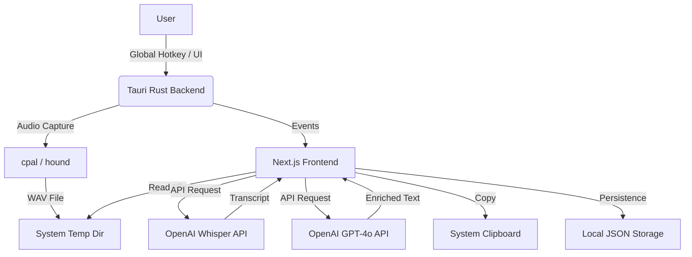

# Voice Intelligence App

A sophisticated desktop application built with Tauri v2 and Next.js that captures speech, transcribes it using OpenAI's Whisper, and enhances the output with GPT-4o for various use cases.

## Problem Description

Many people struggle to take effective notes during meetings, capture quick thoughts accurately, or organize freeform verbal ideas. While mobile apps exist, a desktop-integrated tool that stays out of the way and provides professional-grade AI cleanup and organization can significantly boost productivity.

## Architecture Overview

The application follows a standard Tauri v2 architecture, splitting responsibilities between a high-performance Rust backend and a modern React (Next.js) frontend.



- **Frontend (Next.js)**: Handles UI, state management, orchestration of API calls (transcription, enrichment), and session browsing.
- **Backend (Rust)**: Manages low-level system interactions including global hotkeys, audio device access, and WAV file encoding.
- **API (OpenAI)**: Used for high-quality Speech-to-Text and LLM-based text processing.

## Setup & Development

### Prerequisites

- **Rust**: [Install Rust](https://www.rust-lang.org/tools/install)
- **Node.js**: [Install Node.js](https://nodejs.org/)
- **pnpm**: `npm install -g pnpm`
- **OpenAI API Key**: Required for AI features.

### Installation

1. Clone the repository.
2. Install dependencies:
   ```bash
   pnpm install
   ```

### Running in Development

```bash
pnpm tauri dev
```
This launches the application in debug mode with Hot Module Replacement.

### Production Build

```bash
pnpm tauri build
```
Build artifacts (.exe, .dmg, .AppImage) will be generated in `src-tauri/target/release/bundle/`.

## Design Decisions

- **Tauri v2**: Chosen for its small binary size, security model, and ability to use modern web technologies for the UI while leveraging Rust for system-level tasks.
- **Cloud-First AI**: Using OpenAI's APIs ensures state-of-the-art accuracy for transcription and reasoning without requiring heavy local models that would drain battery and storage.
- **Record-then-Process**: The app records audio to a local WAV file first, then processes it. This ensures no data is lost during network glitches and allows for high-quality, non-real-time processing.
- **Modes**: Support for "Freeform", "Meeting Notes", and "Task Capture" allows users to tailor the AI output to their specific needs.
- **Local Persistence**: Sessions and settings are stored locally on the user's machine using JSON and Tauri's store plugin, respecting privacy.

## Features

- **Global Hotkey**: Toggle recording from anywhere with `Cmd/Ctrl + Shift + V`.
- **History**: Browse past sessions and copy AI-enriched outputs.
- **Enrichment**: Real-time streaming of AI analysis.
- **Context**: Add optional context (e.g., "formal tone", "Project X") to guide the AI.
- **Multi-language**: Supports English, Portuguese, Spanish, French, and German.

## Limitations & Future Ideas

- **Local Processing**: Future versions could support local Whisper (whisper.cpp) for offline use.
- **Speaker Diarization**: Identifying different speakers in meeting notes.
- **Direct Integration**: Sending tasks directly to apps like Notion, Linear, or Slack.
- **Audio Editing**: Ability to trim recordings before processing.
- **Mobile Companion**: Ship the same experience on iOS/Android by reusing the UI layer in Flutter or React Native.
- **Cloud Syncing**: Store recordings and transcripts securely in the cloud so teams can share sessions and restore history across devices.

## Privacy Note

Audio recordings and transcripts are sent to OpenAI for processing. API keys and session history are stored locally and never shared with third parties by the application itself.
